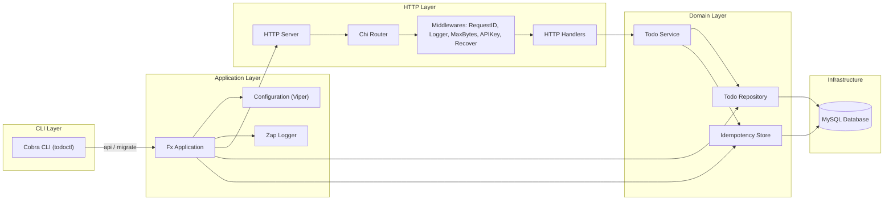

# System Architecture

This document presents a high‑level overview of the Todo service architecture. The implementation follows a clean layering approach and uses dependency injection via **Fx** to wire components together. A Mermaid diagram illustrates the major components and their interactions.

## Overview

The service consists of a CLI application (`todoctl`) that exposes two subcommands: `api` and `migrate`. The `api` command spins up an HTTP server exposing REST endpoints for managing todos, while `migrate` applies database schema migrations. The server is built using the `chi` router with structured logging and API key support. A MySQL database persists data. Idempotency is implemented to safely retry mutating requests.

### Component Responsibilities

- **Cobra CLI**: Parses command‑line arguments and flags. `todoctl api` creates the Fx application and blocks until shut down. `todoctl migrate` reads SQL files from the `migrations/` directory and executes them against the database.

- **Fx Application**: Manages the lifecycle of all components. It provides the configuration, logger, database connection, repository, idempotency store, service, HTTP router, and starts the HTTP server. 

- **Configuration**: Loaded via Viper from environment variables. Defines HTTP server settings (port, timeouts, body size), database DSN, and the optional API key.

- **HTTP Server & Router**: Built on top of the `chi` router with middlewares for request ID generation, structured logging, body size limiting, API key authentication, and panic recovery. Defines endpoints `/v1/todos` (POST, PATCH, GET) and health/readiness endpoints.

- **Service**: Implements business logic for creating, updating, and listing todos. Performs validation, uniqueness checks, and interacts with the repository. Integrates with the idempotency store to replay responses for repeated requests.

- **Repository**: Encapsulates SQL queries against the MySQL database. Supports bulk create, partial update, and list operations. Implements both offset and cursor (keyset) pagination strategies. Returns typed `Todo` objects to the service.

- **Idempotency Store**: Persists idempotency keys along with the original HTTP method, path, response status, and body. On repeated requests with the same key, the stored response is returned to the client without re‑executing the business logic.

- **Database (MySQL)**: Stores `todos` and `idempotency_keys` tables. Indexed fields facilitate fast lookups by id and due date. Timestamp columns (`created_at`, `updated_at`) support auditability.

## Security Considerations

Several measures are taken to harden the service:

- **Environment‑based Configuration**: Secrets (DB credentials, API keys) are not hard‑coded. Environment variables provide them at runtime, keeping them out of source control.
- **API Key Authentication**: When enabled, clients must provide a correct `X-API-Key` header. Unauthorized requests return `401` without revealing details. Logging of unauthorized attempts helps detect abuse.
- **Request ID & Structured Logging**: Every request is tagged with a unique ID and logged with method, path, status, duration, and remote address. This aids troubleshooting and incident response.
- **Body Size Limits**: `MaxBytes` middleware caps request bodies to a configurable size (default 1 MiB) to prevent memory exhaustion. Large bodies return `413` without processing.
- **Input Validation**: Handlers validate JSON payloads (e.g. titles must be non-empty, duplicate titles within a batch are disallowed). Errors are returned with appropriate HTTP status codes.
- **Idempotency**: Idempotency keys ensure safe retries for create and update operations. Responses are stored and replayed, preventing duplicate effects when clients retry after network failures.
- **Panic Recovery**: A recovery middleware catches panics, logs the stack trace, and returns a generic `500` error without leaking internal details.
- **Parameterized Queries**: All SQL statements use prepared statements with parameters, mitigating SQL injection risks.
- **Graceful Shutdown**: Fx lifecycle hooks gracefully close the database connection and the HTTP server. Requests in flight are given time to complete before shutdown.

